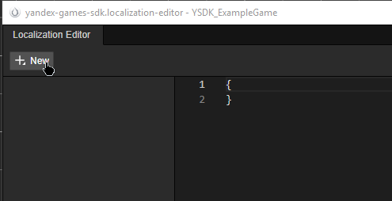
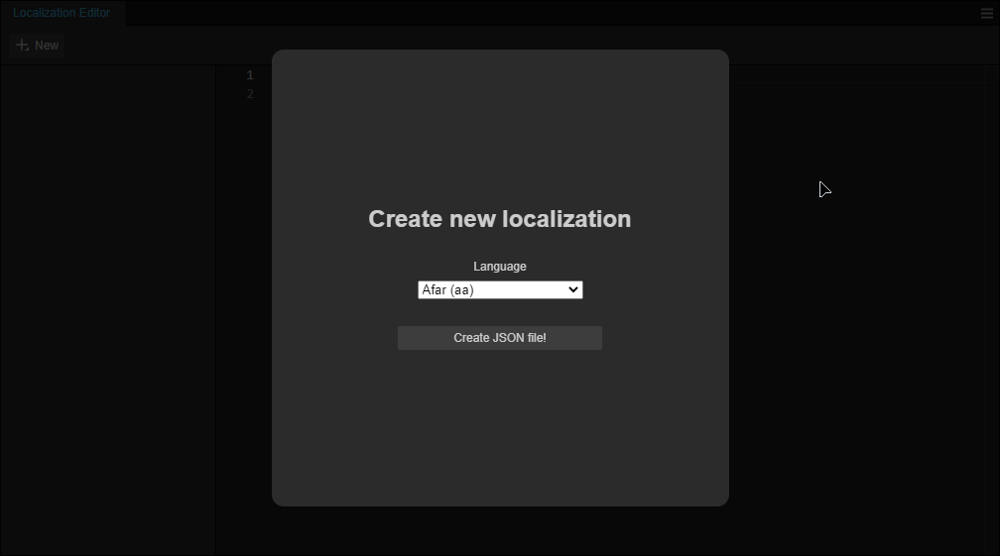
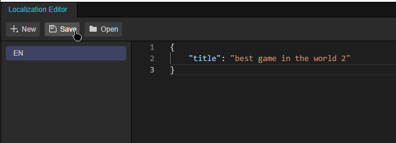
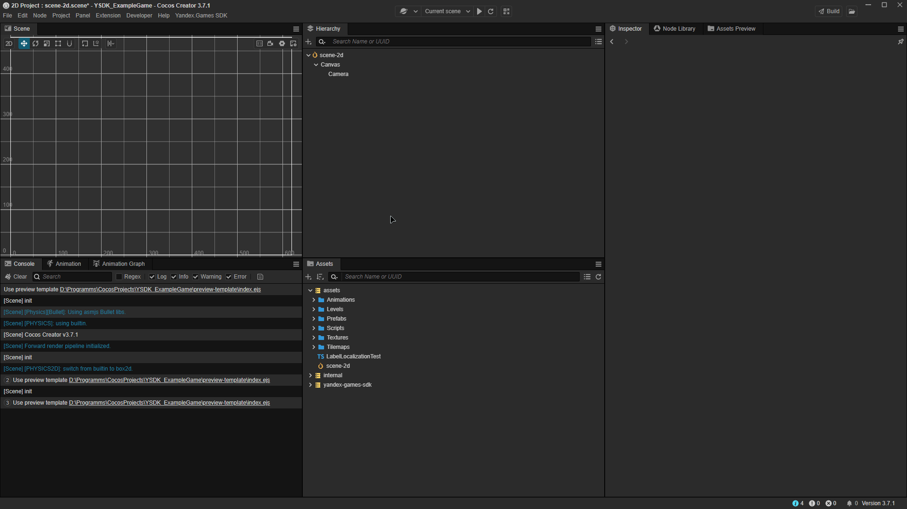
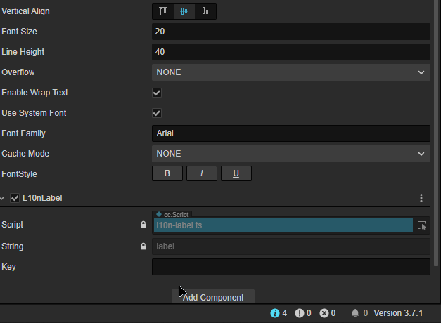
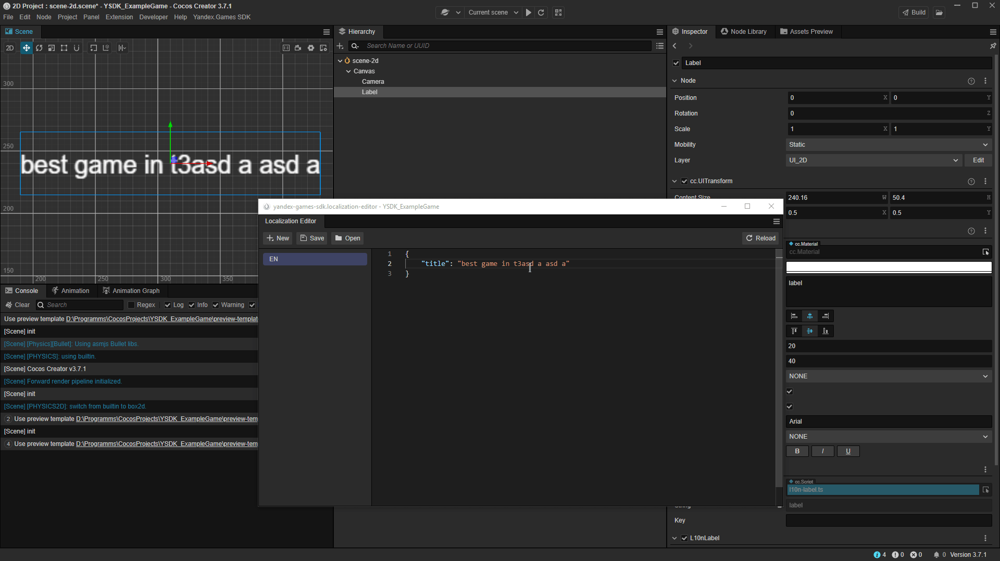
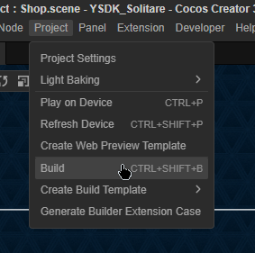
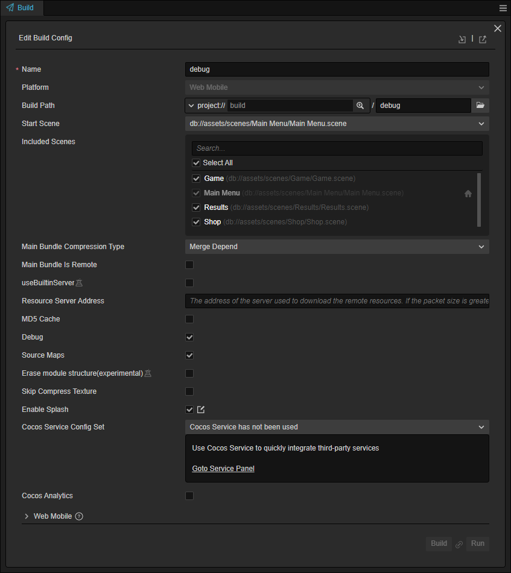
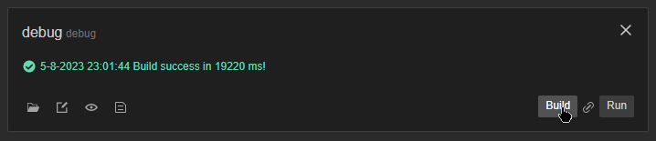

# Cocos documentation

1. [Getting started](#getting-started)
2. [Yandex Games SDK API](#yandex-games-sdk-api)
3. [Localization](#localization)
4. [Testing](#testing)

[Chinese documentation](README_ZH.md)

## Getting started

### Installing the plugin

After [downloading the plugin](https://github.com/yandex-games-plugins/cocos/releases/latest), open your project in Cocos Creator or create a new one. In the upper panel, hover over _Extension_ and select _Extension Manager_.


Next, hover over _Import Extension File(.zip)_ and select the plugin you downloaded previously from the pop-up menu.


### Setting up templates

You will most likely see messages like the ones below after installing the plugin. That’s because Yandex Games requires [Yandex Games SDK](https://yandex.ru/dev/games/doc/en/) to be imported directly in files like index.html, which appear after compilation.


To solve this problem, visit the new Yandex Games SDK section and select the option to generate templates so the plugin generates the necessary templates by itself. You can also write them yourself.

If the templates are compiled successfully, the plugin should output a message like the one below to the console. It means everything is fine and you can get to work.


For more detail: [customization of build templates](https://docs.cocos.com/creator/manual/en/editor/preview/browser.html), [customization of Cocos Creator web preview](https://docs.cocos.com/creator/manual/en/editor/preview/browser.html)

## Yandex Games SDK API

After installing the plugin, you’ll find the `ysdk` object, which is a typed equivalent of [the eponymous object from the Yandex Games SDK](https://yandex.ru/dev/games/doc/dg/sdk/sdk-gameready.html). It lets you access all the SDK methods.

Here’s an example of how to use [environment variables](https://yandex.ru/dev/games/doc/dg/sdk/sdk-environment.html) from the Yandex Games SDK.

```tsx
import { Component } from "cc";
import { ysdk } from "extensions/yandex-games-sdk/static/assets/ysdk";
const { ccclass, property } = _decorator;

@ccclass("YourGameComponent")
export class YourGameComponent extends Component {
  start() {
    console.debug(`App ID: ${ysdk.environment.app.id}`);
    console.debug(`User Language: ${ysdk.environment.i18n.lang}`);
    console.debug(`URL Payload: ${ysdk.environment.payload}`);
  }

  update(deltaTime: number) {}
}
```

### Ad Display component

For example, let's write a component for a button that plays a rewarded ad.

We’ll also add the `OnReward` method and pass it as a callback for the `add.adv.showRewardedVideo()` method to add logic to the reward event.

```tsx
import { _decorator, Button, Component } from "cc";
import { ysdk } from "extensions/yandex-games-sdk/static/assets/ysdk";
const { ccclass, property, requireComponent } = _decorator;

@ccclass("RewardADButton")
@requireComponent(Button)
export class RewardADButton extends Component {
  start() {
    this.node.on("click", this.onClick.bind(this));
  }

  onClick() {
    const callbacks = {
      onRewarded: this.onReward.bind(this),
    };

    ysdk.adv.showRewardedVideo({ callbacks });
  }

  onReward() {
    // Reward user
  }
}
```

When you click the button with this component on the Yandex platform, you’ll now see an ad. You can read through the Testing section for simplified testing.

## Localization

### Localization Editor

Translations are stored in the JSON format inside the project, and we strongly recommend using it to edit them.

After you install the plugin in the Yandex Games SDK section, click the _Localization Editor_ option.

The editor will look pretty empty at first. That’s because you need to create your first localization, which you can do by clicking the _New_ button in the upper left corner.



You’ll see a modal window that lets you select a language. When you’re done, click _Create JSON file!_



For example, let's choose _English (en)_ and enter the following in the editor.

```json
{
  "title": "best game in the world 2"
}
```

Click the _Save_ button to save your localization and check it out in the game.



### Applying your localization

Localization can be applied in two ways: through the l10n.t() method or through a smart localization component.

#### The l10n.t method

Let's try using the l10n.t() method first. Create a new component and enter the following inside it:

```tsx
import { _decorator, Component, Label } from "cc";
import { l10n } from "../extensions/yandex-games-sdk/static/assets/ysdk";
const { ccclass, requireComponent } = _decorator;

@ccclass("ButtonLozalizationTest") // Component name
@requireComponent(Label) // Dependency on the Label component
export class ButtonLozalizationTest extends Component {
  onLoad() {
    const label = this.getComponent(Label); // Getting the Label component
    label.string = l10n.t("title"); // We set the Label to the text that we received from the previously declared key.
  }
}
```

Once you create a node with a Label component on the stage, you can localize it by dragging and dropping the component into the node.



#### Ready-made L10nLabel component

If you don’t want to reinvent the wheel, there’s a ready-made component in the plugin that renders the key directly in the editor. You don't have to compile the project to see how it looks since it’s automatically updated when changes are made in the translation editor.

Click the _Add Component_ button for the node you‘re interested in, scroll to the _YandexGamesSDK_ group, and select _L10nLabel_.



You can now enter your key in the _Key_ field and admire the result. No matter how you modify the localization, it will change right there in front of you.



## Testing

Games can be run on the platform from a local server to simplify development and testing for SDK-related functionality.

Please note that you’ll need to [add](https://yandex.ru/dev/games/doc/dg/console/add-new-game.html) a draft of the game using the Yandex Games console.

### Build setup

The first thing to do is configure the project build in the _Project →_ _Build_ panel.



In the window that appears, click _New Build Task_ to create a new configuration for the build.

Configure the settings. You’ll generally want to include the _Source Maps_ and _Debug_ items to make debugging easier.



Once setup is complete, click the _Build_ button to build the project.

Next, go to the folder where your project is located. You’ll find a folder structured like this:

```
Project name/
└── build/
    └── debug/
        ├── ...
        └── index.html
```

## ## Setting up a local server

The next step is to configure a local server. Here’s one way to do that:

1. Install npm by following the instructions on [Node.JS](<[https://nodejs.org/en](https://nodejs.org/en)/>). Use `npm` to install `http-server`:

```
> npm install -g http-server
```

1. Go to the build folder and use openssl to create a certificate and a private key:

   ```
   > cd PATH_DO_PROJECT/build/
   > openssl genrsa 2048 > key.pem
   > openssl req -x509 -days 365 -new -key key.pem -out cert.pem
   # fill in the required information
   ```

2. Start the local server:

   ```
   > npx http-server -S -C ../cert.pem -K ../key.pem -o --port 6577
   Starting up http-server, serving ./ through https
   ...
   Available on:
     https://127.0.0.1:6577
   Hit CTRL-C to stop the server
   ```

### Testing

With your local server running, you can test your game using this link, where XXXXXX is your draft’s code:

```
https://yandex.ru/games/app/XXXXXX?draft=true&game_url=https://localhost:6577
```

If you want to test a newer version, you can just reassemble the project in the **\*\***Build**\*\*** panel without changing anything and reload the page at the end of the build.


