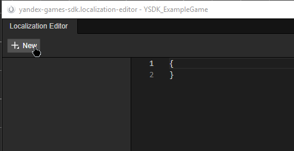
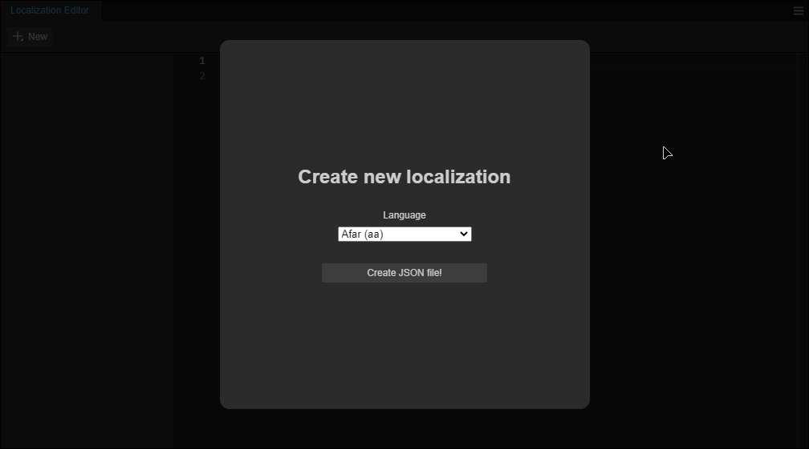
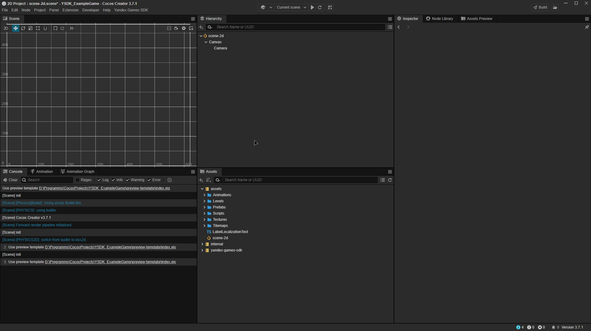
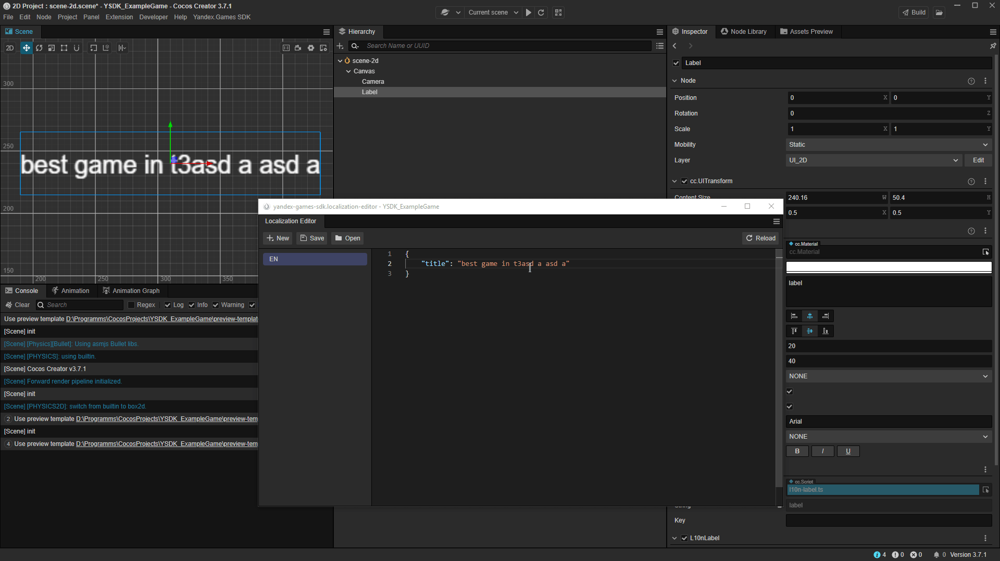
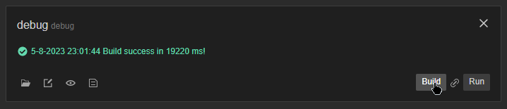

# Cocos documentation

1. [使用准备](#使用准备)
2. [Yandex.SDK 游戏方式](#游戏方式)
3. [本地化](#本地化)
4. [测试](#测试)

## 使用准备

### 安装插件

下载插件之后，在 Cocos Creator 中打开项目或新建。在上方面板中，鼠标悬停在“Extension”上，选择“Extension Manager”。
[Plugin](https://github.com/yandex-games-plugins/cocos/releases/latest)


之后，鼠标悬停在“Import Extension File(.zip)”上，然后从弹出菜单中选择之前下载的插件。


### 设置模板

安装插件之后，可能会显示类似于下列内容的信息。这是因为 Yandex Games 需要将 [Yandex Games SDK](https://yandex.ru/dev/games/doc/en/) 直接导入 index.html 这样的文件中，它将在汇编成功之后显示。


想要解决此问题，可访问新的 Yandex Games SDK 版块，选择生成模板选项，让插件自行生成必要的模板。您也可以自己编写。

如果模板汇编成功，插件应在控制台中输出一条类似于下方内容的消息。意思是一切顺利，可以正常运行。


更多详细内容：[自定义构建模板](https://docs.cocos.com/creator/manual/en/editor/preview/browser.html)、[自定义 Cocos Creator 网页预览](https://docs.cocos.com/creator/manual/en/editor/preview/browser.html)


## 游戏方式

安装插件之后可以找到 ysdk 对象，它是 [Yandex Games SDK](https://yandex.ru/dev/games/doc/dg/sdk/sdk-gameready.html) 中同名对象的同类等同对象。通过它可以访问所有 SDK 方式。

关于如何使用 [Yandex Games SDK](https://yandex.ru/dev/games/doc/dg/sdk/sdk-environment.html) 中的环境变量，请看下面的示例。

```tsx
import { Component } from "cc";
import { ysdk } from "extensions/yandex-games-sdk/static/assets/ysdk";
const { ccclass, property } = _decorator;

@ccclass("YourGameComponent")
export class YourGameComponent extends Component {
  start() {
    console.debug(`App ID: ${ysdk.environment.app.id}`);
    console.debug(`User Language: ${ysdk.environment.i18n.lang}`);
    console.debug(`URL Payload: ${ysdk.environment.payload}`);
  }

  update(deltaTime: number) {}
}
```

### 广告显示组件

例如，我们可为激励广告的播放按钮写一个组件。

我们也可以添加 OnReward 方式，然后把它作为 add.adv.showRewardedVideo() 方式的回调来添加奖励事件的逻辑。

```tsx
import { _decorator, Button, Component } from "cc";
import { ysdk } from "extensions/yandex-games-sdk/static/assets/ysdk";
const { ccclass, property, requireComponent } = _decorator;

@ccclass("RewardADButton")
@requireComponent(Button)
export class RewardADButton extends Component {
  start() {
    this.node.on("click", this.onClick.bind(this));
  }

  onClick() {
    const callbacks = {
      onRewarded: this.onReward.bind(this),
    };

    ysdk.adv.showRewardedVideo({ callbacks });
  }

  onReward() {
    // Reward user
  }
}
```

在 Yandex 平台点击添加了该组件的按钮时，就将显示一条广告。有关如何简化测试，请阅读测试版块。

## 本地化

### 本地化编辑器

译文以 JSON 格式保存在项目中，我们强烈建议直接用它来进行编辑。

在 Yandex Games SDK 版块安装插件之后，点击“Localization Editor”选项。

编辑器基本上是完全空白的。这是因为需要创建第一项本地化，点击左上角的“New”按钮。



之后在显示的模态窗口中选择一种语言。完成后点击“Create JSON file!”



例如，我们可以选择英语 (en)，然后在编辑器中输入下面的内容。

```json
{
  "title": "best game in the world 2"
}
```

点击“Save”按钮即可保存本地化结果，然后前往游戏中进行检验。


### 应用本地化

应用本地化有两种方式：l10n.t() 方法或者使用智能本地化组件。

#### l10n.t 方法

首先介绍 l10n.t() 方法。新建一个组件，里面输入以下内容：

```tsx
import { _decorator, Component, Label } from "cc";
import { l10n } from "../extensions/yandex-games-sdk/static/assets/ysdk";
const { ccclass, requireComponent } = _decorator;

@ccclass("ButtonLozalizationTest") // Component name
@requireComponent(Label) // Dependency on the Label component
export class ButtonLozalizationTest extends Component {
  onLoad() {
    const label = this.getComponent(Label); // Getting the Label component
    label.string = l10n.t("title"); // We set the Label to the text that we received from the previously declared key.
  }
}
```

在暂存区中用 Label 组件创建节点之后，即可将该组件拖放到节点中进行本地化。



#### 预建 L10nLabel 组件

如果不想重新创建可以选择插件中的预建组件，直接在编辑器中渲染键值。在译文编辑器中修改后它将自动更新，所以无需进行项目汇编。

在要更改的节点中点击“Add Component”按钮，滚动至 “YandexGamesSDK”组，选择“L10nLabel”。


然后即可在“Key”字段中输入键值，并查看结果。无论如何修改本地化内容，它都会直接显示修改结果。



## 测试

游戏可通过本地服务器运行，这样能够简化 SDK 相关功能的开发和测试。


请注意，需要用 [Yandex Games](https://yandex.ru/dev/games/doc/dg/console/add-new-game.html) 控制台添加游戏的草稿。

### 构建设置

首先要在“Project → Build”面板中配置项目的构建。


在弹出窗口中点击“New Build Task”创建新的构建配置。

完成相应设置。一般建议勾选“Source Maps”和“Debug”这两项，以便于进行调试。


设置完成后，点击“Build”按钮即可构建项目。

之后，前往项目所在的文件夹。文件夹的结构类似于下图：

```
Project name/
└── build/
    └── debug/
        ├── ...
        └── index.html
```

## 设置本地服务器

接下来是配置本地服务器。具体方法示例如下：
1. 按 [Node.JS](https://nodejs.org/en/) 中的说明安装 npm。用 npm 安装 http 服务器：

```
> npm install -g http-server
```

2. 前往构建文件，用 openssl 创建凭证和专有密钥：
   ```
   > cd PATH_DO_PROJECT/build/
   > openssl genrsa 2048 > key.pem
   > openssl req -x509 -days 365 -new -key key.pem -out cert.pem
   # fill in the required information
   ```

3. 启动本地服务器：
   ```
   > npx http-server -S -C ../cert.pem -K ../key.pem -o --port 6577
   Starting up http-server, serving ./ through https
   ...
   Available on:
     https://127.0.0.1:6577
   Hit CTRL-C to stop the server
   ```

### 测试

本地服务器开始运行之后，可以用下面的链接进行游戏测试，其中 XXXXXX 为草稿代码：

```
https://yandex.ru/games/app/XXXXXX?draft=true&game_url=https://localhost:6577
```

如果要测试新版本，只需在“Build”面板中对项目进行重新汇编，无需做任何更改，构建结束后重新加载页面即可。


